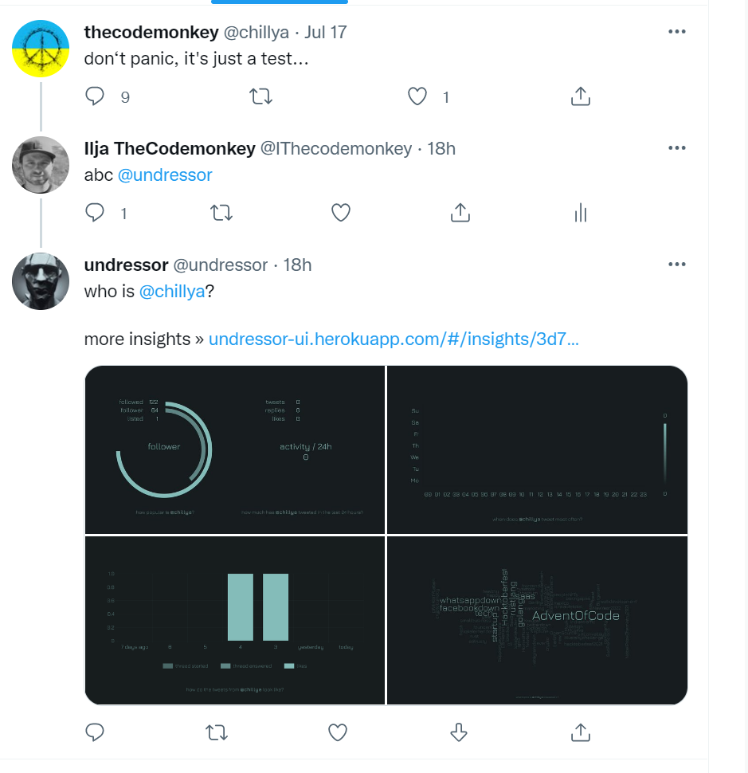

# undressor

Twitter Bot + dashboard to visualize interest and activities of twitter accounts. 

This project was created during the Twitter Hackathon 
<a href="https://chirpdevchallenge.devpost.com/">chirp DEV {challenge} 2022</a>


<br/><br/>

- [motivation](#motivation)
- [purpose](#purpose)
- [what exactly is undressor](#what-exactly-is-undressor)  
- [usage](#usage)
- [development](#development)
    - [getting started](#getting-started)
    - [running in docker](#running-in-docker)       
    - [project structure](#project-structure)
    - [architecture](#architecture)
- [license](#license)

<br/><br/>


## motivation

Of course, one of the reasons was just to play around with the Twitter API V2 and participate in the hackathon. 

But the real motivation was to develop a possible solution to the biggest challenge of all social networks. Uncontrolled spreading of MANIPULATION and hate speech!

Social networks like Twitter have brought the world together and given all of us unprecedented freedom of speech. Everyone can express their opinion, really EVERYONE. It's a great thing! 

But it is also a problem. There are people who are not interested in freedom of speech, but in deliberate manipulation. Or they simply want to spread hate and agitation. There are also people who unwittingly spread half-truths because they don't know any better. Either way, today's social networks are designed for the ultimate freedom of speech and offer practically no mechanisms to prevent abuse. There is no balance between freedom and anarchy. 

Undressor is an attempt to create exactly this balance in the Twitter universe. 

The basic idea of Undressor is based on a self-regulating mechanism that provides more transparency. Anyone can request the bot to learn more about the interests and activities of the authors. The analysis will be graphically processed and posted as an answer in the thread for everyone visible. This has 2 effects:

1. you yourself, but also the other users learn interesting insights about the author and can much better classify the content.

2. authors who deliberately manipulate or spread hate speech would have less success finding supporters through this transparency. E.g. because an account is recognized as a bot due to non-stop activity. Or because the hashtag/keyword analysis proves a clearly radical attitude. 

Undressor does not judge, it just makes the hidden information visible and understandable for everyone. Users can read this information and make their own judgment!

<br/><br/>

## purpose

We asked ourselves what current challenges the Twitter developer community is dealing with. To do this, we  researched various ranking lists of the best Twitter bots. Here are some of those sources:

- https://beebom.com/best-twitter-bots/
- https://increditools.com/twitter-bots/
- https://techpp.com/2021/12/10/best-twitter-bots/
- https://gist.github.com/derhuerst/1cb20598b692aa87d9bb

There you can find many bots and solutions that help to get more reach. Among the TOP 10 are also bots like: @year_progress, @emojimashupbot, or also @StupidCounter. We think that the social impact of these bots is not very big.

We haven't found a single solution that addresses truly real-world challenges. Issues like: Hate Speech, Propaganda, Manipulation, Radicalization of society or even Digital Detox are not addressed at all. These are real problems that everyone should be aware of by now. 

Why are such issues not being addressed? Why does the Twitter community celebrate a bot that tweets a year's progress in ASCII characters every day? This is absolutely meaningless in our eyes. 

Our call to the developer community is: 

> Let's look together at what really MATTERS!

<br/><br/>


## what exactly is undressor

This project consists of 2 separate solutions:

1. the Twitter BOT
2. the online portal

<br/><br/>



The Twitter BOT provides a seamless user experience. Users can request the bot via @undressor and gets a reply directly without leaving Twitter. This is very convenient. However, the information content that is tweeted back by the bot in the form of images is still very limited. 

<br/><br/>


In order to provide the user with further detailed information, the online portal(https://undressor-ui.herokuapp.com/) was also developed. In addition to the charts, easy-to-read texts are also provided there. The textual content is intended to tell a story, which at the same time is to be supported by graphically prepared charts. 

<br/><br/>


In addition, the portal offers the possibility to directly analyze different Twitter accounts without affecting an ongoing thread in Twitter. 

<br/><br/>


A dashboard with many more interesting insights is also planned for the future.


<br/><br/>

## usage

You can mention the bot in any Twitter reply via @undressor. The bot then analyzes the account of the author of the original post, visualizes the corresponding data and tweets the analysis back as set of 4 images.

The post also includes a link to the online portal. There you can get more information about the account. 

<br/><br/>


## development

If you are a developer and are interested in this open source solution, then you will find here all the information you need to get the project running locally.

<br/><br/>


### getting started

1. get project sources from git

    ```bash
    git clone https://github.com/thecodemonkey/undressor.git
    ```    

2. build and run ui

    ```bash
    cd ui
    npm i
    ng serve
    ```    
3. open ui in browser http://localhost:4200
4. build api
    
    ```bash
    cd api
    npm i
    npm run build
    ```    
5. configure environment variables
    
    ```bash
    #create .env file in the root of api directory
    # this file contains secretes, and is included in the .gitignore

    touch .env 
    ```

    Add these variables to the .env file:

    ```bash
    
    #rest api port
    PORT=3000                     

    # To use the Twitter API, the first thing you need is a Twitter
    # developer account. Create Twitter account under 
    # https://developer.twitter.com/ and transfer all necessary 
    # secrets into the corresponding variables:

    #twitter api app key 
    APP_KEY=xxx                   
    #twitter api app secret
    APP_SECRET=xxx                
    #twitter api access token
    ACCESS_TOKEN=xxx              
    #twitter api access secret
    ACCESS_SECRET=xxx             

    #twitter api bearer token  
    BEARER_TOKEN=xxx              

    #twitter username of a bot account
    TWITTER_NAME=undressor        

    #connection string of postgresdb
    DATABASE_URL=[DB_CONN_STR]

    #polling interval for the bot
    BOT_POLLING_INTERVAL=10
    #enables/disables the bot
    BOT_ON=true
    #enables/disables the dry run of the bot
    #dry run do analysis, save images locally and do not make real tweets
    BOT_DRY_RUN=false

    #base url to generate url for the reply
    BASE_URL="http://localhost:4200/"
    #base url to generate images
    BASE_IMAGE_URL="http://localhost:4200/"


    #16 bit encryption vector
    ENCRYPTION_IV=bC434Umzlk3Tra1I
    #encryption key
    ENCRYPTION_KEY=abC5pumlZR39g91RyRm94bOaPi1zLr0I
    ```

6. run api
   
    ```bash
    npm run start
    ```   

7. run bot
   
    ```bash
    npm run bot
    ```


<br/><br/>

### running in docker

xxx

<br/><br/>

### project structure

This repository consists of 2 separate code bases:

1. UI/Frontend
2. Backend (BOT + REST API)


<pre>

 undressor
   ║
   ╠═ .github/workflows  (gh action)
   ║
   ╠═ docs               (docs/imgs)
   ║      
   ╠═ ui                 (UI/Angular Project)
   ║
   ╚═ api                (REST API/BOT Node/Typescript project)

</pre>

To load the project in an IDE, please do not use the root directory, but the respective subdirectory [ui](ui) or [api](api)!

<br/><br/>

### architecture

Undressor verwendet vor allem die Twitter Infrastruktur, bestehend aus der eigentlichen Twitter App und der entsprechenden Twitter API. 


The solution itself consists of 4 separate runtime components:

1. the Web APP
2. the REST API
3. the BOT
4. and the associated PostgreSQL database

The communication between the Undressor components and the Twitter API is handled by an npm lib "twitter-api-v2".

<br/><br/>

As a result of the analysis, the bot creates several charts in PNG format and tweets them as a reply. The creation of these images works as follows:<br/>


<br/><br/>


## license

i ❤️ [MIT](LICENSE)